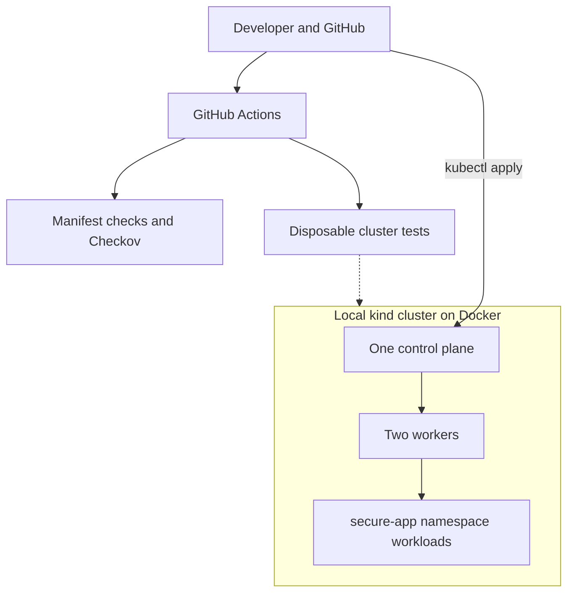
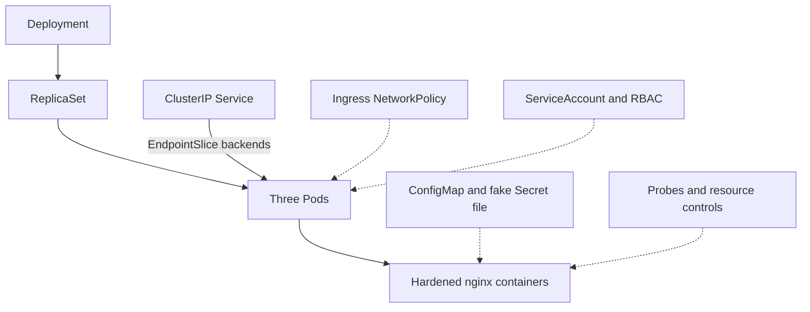
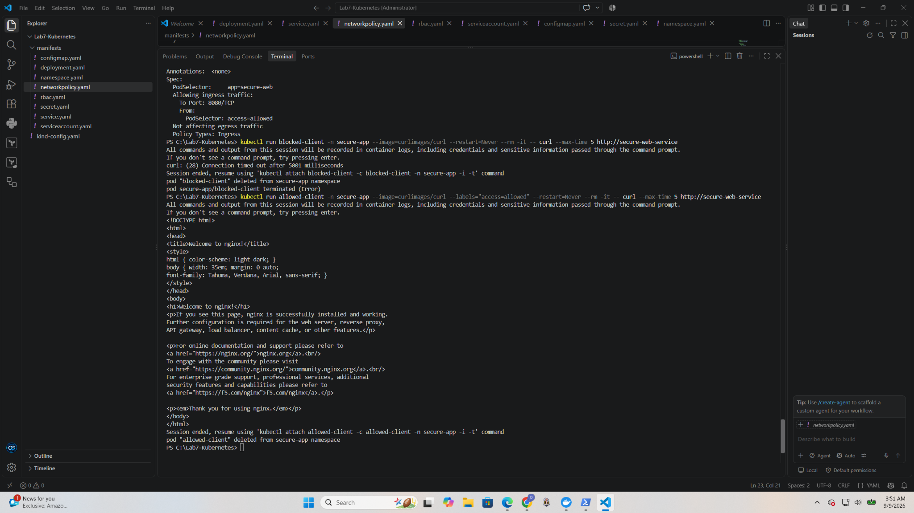
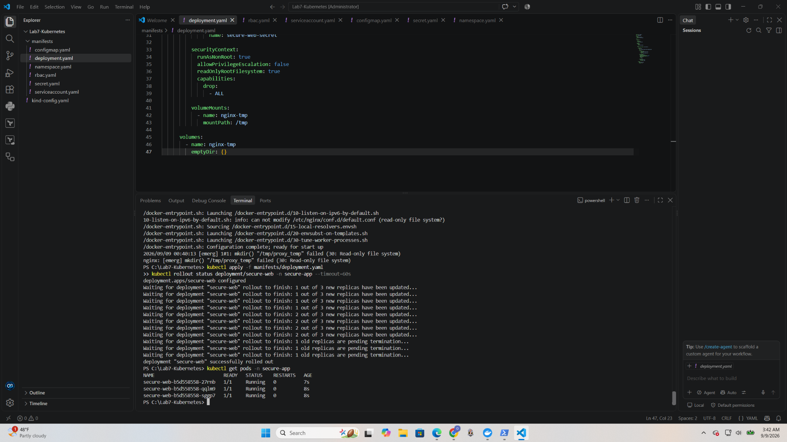

# Lab 7 · Secure Kubernetes Deployment & Troubleshooting


[](https://github.com/ozangirginwork-wq/secure-kubernetes-deployment-lab/actions/workflows/security-scan.yml)

A local Kubernetes lab focused on deploying a small web service, reducing its privileges, and proving how it behaves when something goes wrong. Three nginx replicas run in a dedicated namespace on a **three-node kind cluster: one control plane and two workers**.

The emphasis is practical troubleshooting: follow the Deployment → ReplicaSet → Pod relationship, inspect Service backends, recover from a failed security rollout, and compare allowed and denied network requests.

**Scope:** a personal learning project on Docker and kind. No AWS account, managed cluster, cloud load balancer, or cloud infrastructure is used. It is not a production deployment or a claim of professional Kubernetes experience.

## At a glance

| Area | What this project demonstrates |
| --- | --- |
| Deployment | Declarative YAML, three replicas, rolling updates and reconciliation |
| Networking | ClusterIP Service, labels, EndpointSlices and ingress NetworkPolicy |
| Container security | Non-root nginx, read-only root filesystem, dropped capabilities, seccomp and no privilege escalation |
| Access | Dedicated ServiceAccount, limited RBAC and automatic token mounting disabled |
| Reliability | Readiness/liveness probes, CPU/memory requests and limits, bounded temporary storage |
| Configuration | ConfigMap environment injection and a read-only Secret file containing only a fake value |
| Verification | Checkov, cross-file manifest validation and disposable kind integration tests in GitHub Actions |

**Start here:** [original evidence](evidence/README.md) · [local reproduction](docs/reproduce.md) · [troubleshooting](docs/troubleshooting.md) · [security review](docs/security-review.md) · [CI runs](https://github.com/ozangirginwork-wq/secure-kubernetes-deployment-lab/actions)

## Architecture

The namespace is a logical boundary across the workers; it is not a separate machine. Three replicas can share two workers. All three kind nodes still share one physical host.



**Inside `secure-app`:** Calico enforces the ingress policy on the worker nodes. The table below explains each supporting control.



GitHub Actions validates code and creates its own disposable kind cluster. It does not deploy to the developer's computer. Calico is explicitly installed in the reproduction path; the original screenshots do not establish which policy provider was installed during the first session.

## Security controls and their limits

| Control | Implementation | Why it matters |
| --- | --- | --- |
| Namespace admission | Restricted Pod Security Standard, pinned to v1.34 | Rejects Pods that violate the selected baseline |
| Non-root process | Unprivileged nginx image; explicit UID/GID 101 | Avoids running nginx as root; see the documented high-UID finding |
| Filesystem | Read-only root; bounded writable `/tmp` | Supports nginx temporary files without making the whole image writable |
| Privileges | Drop `ALL`, disable privilege escalation, `RuntimeDefault` seccomp | Reduces the container's available privileges and system calls |
| API identity | Dedicated account, no automatic token mount | nginx does not need a Kubernetes API token |
| RBAC example | Only `get` on `secure-web-config` in `secure-app` | Demonstrates a named-resource grant; no Secret access or wildcard permissions |
| NetworkPolicy | Only same-namespace Pods labeled `access=allowed` can reach selected web Pods on TCP 8080 | Restricts ordinary Pod ingress; egress is deliberately unrestricted |
| Service exposure | ClusterIP; localhost-only port-forward | No public load balancer or NodePort |
| Secrets | Fake example mounted read-only at `/etc/demo-secret/DEMO_API_KEY` | Demonstrates file delivery without putting the value into the process environment |

Labels are not user authentication: someone allowed to create or relabel Pods in the namespace can satisfy the policy. NetworkPolicy does not replace RBAC. Port-forward access goes through the Kubernetes API and is **not proof of NetworkPolicy enforcement**.

`APP_ENV` and `APP_NAME` demonstrate ConfigMap injection; stock nginx does not use them to configure its web server. The fake Secret is a teaching artifact, not an nginx credential. The RBAC grant is an authorization exercise; nginx itself makes no API calls.

**Never commit real secrets.** `manifests/secret.yaml` contains only `EXAMPLE_ONLY_NOT_A_REAL_SECRET`. Kubernetes Secret base64 encoding is not encryption. Encryption at rest, rotation and external secret management are outside this local application lab.

## What was tested

### NetworkPolicy

The original session captured a blocked client timing out and a labeled client receiving the nginx page. The automated test strengthens that demonstration by using the **same client Pod** and the Service IP: allow → block → allow. This separates label enforcement from DNS failures or a generally unavailable server. Three blocked attempts must return curl timeout code 28; another error does not count as a policy pass.



*Original lab capture: the unauthorized request times out; adding the expected client label permits an nginx response. See [evidence context](evidence/README.md) for version differences.*

### Self-healing and service discovery

Deleting one managed Pod does not delete the Deployment. Its ReplicaSet creates a replacement to restore the desired replica count. The original foundations exercise captured that replacement; the automated test additionally checks that the deleted Pod UID is absent and all three replacement/current replicas are Ready. It does not claim zero downtime or recovery from loss of the physical host.

A Service selects Pods by label. EndpointSlices expose the backend addresses and readiness information used for Service routing; they are preferable to the deprecated Endpoints API for this lab.

### Hardened rollout troubleshooting

An early rollout failed because standard nginx expected root. Switching to the unprivileged image addressed that mismatch. A later attempt failed because nginx needed to create `/tmp/proxy_temp` while the filesystem was read-only. Mounting an `emptyDir` at `/tmp` preserved the read-only root while allowing the required writes.



*The original terminal shows the filesystem error, the manifest update, a successful rollout, and three Running/Ready Pods.*

## Security scanning and CI

The workflow has two jobs:

1. **Static validation:** reject duplicate YAML keys/resources, missing namespace objects, selector/reference mistakes and any change to the explicitly fake Secret. Run pinned Checkov against `manifests/`.
2. **Integration:** create a disposable three-node kind cluster, install Calico, perform server-side dry-run, deploy, test RBAC, verify the Secret mount/token absence, exercise NetworkPolicy and delete/recreate a Pod. Delete the cluster even after failures.

Checkov currently reports **104 passed, 1 failed, 0 skipped** with version **3.2.495**. The remaining finding stays visible: `CKV_K8S_40` (the image's standard UID 101). Only this documented finding is non-blocking; other security failures fail CI. A green badge means the configured gate passed, not that every Checkov finding disappeared.

The initial repository scan had 24 failures, including an old Deployment accidentally saved as `namespace.yaml`. Fixing that file also removes a duplicate scanned Deployment, so the before/after check totals are **not a like-for-like security score**. [Review the exceptions, scope and changes](docs/security-review.md).

This scan does not audit the live API server, etcd, node OS, Calico installation, container CVEs or the host. Cluster-level controls cannot be inferred from an application scan. Test fixtures in `tests/` are outside the application scan and are reviewed separately; the curl Pod is temporary and uses the same restricted security baseline.

## Reproduce locally

Use Docker with Linux containers, Git, kubectl and kind. The documented recipe uses kind **v0.30.0**, Kubernetes **v1.34.0**, Calico **v3.31.0**, and nginx **1.28.0-alpine** for a bounded learning setup, not a recommendation to freeze production versions. Allow roughly 6 GB of Docker memory for the three nodes and CNI; available resources affect startup time.

```powershell
git clone https://github.com/ozangirginwork-wq/secure-kubernetes-deployment-lab.git
cd secure-kubernetes-deployment-lab
```

Follow the [PowerShell reproduction guide](docs/reproduce.md) to create the cluster, install policy enforcement, deploy and test. It includes cleanup and a Bash test entry point for Linux/WSL. Do not apply these files to an unrelated cluster.

## Lessons learned

- A valid YAML document can still describe the wrong object. File names do not enforce Kubernetes resource types.
- Security settings must fit the image: non-root execution and writable paths should be tested together.
- Readiness controls traffic eligibility; liveness restarts an unhealthy container. ReplicaSet reconciliation replaces deleted Pods.
- A NetworkPolicy object existing in the API is not enough: test denial and a successful control request.
- A green CI badge is useful only when its failure policy is clear.
- Evidence should show the investigation and recovery, with original results distinguished from later improvements.

## Repository guide

| Path | Purpose |
| --- | --- |
| `kind-config.yaml` | Local three-node topology and Calico-compatible networking |
| `manifests/` | Nine application resources across eight YAML files |
| `tests/client.yaml` | Temporary restricted client for network testing |
| `scripts/` | Manifest consistency checks and repeatable runtime assertions |
| `.github/workflows/` | Security and runtime validation |
| `docs/` | Reproduction, troubleshooting and review rationale |
| `evidence/` | Original screenshots, provenance and audit results |
| `assets/` | Portfolio banner; illustrative, not test evidence |

## References

- [kind configuration](https://kind.sigs.k8s.io/docs/user/configuration/) and [Calico on kind](https://docs.tigera.io/calico/latest/getting-started/kubernetes/kind)
- [Kubernetes NetworkPolicy](https://kubernetes.io/docs/concepts/services-networking/network-policies/)
- [Unprivileged nginx image](https://github.com/nginx/docker-nginx-unprivileged)
- [Checkov](https://www.checkov.io/)

## Related portfolio labs

- [Lab 1: Linux support & troubleshooting](https://github.com/ozangirginwork-wq/linux-it-support-troubleshooting-lab)
- [Lab 2: Windows Server & Active Directory](https://github.com/ozangirginwork-wq/windows-server-active-directory-lab)
- [Lab 3: Python IT automation](https://github.com/ozangirginwork-wq/python-it-cloud-automation-lab)
- [Lab 4: AWS security incident investigation](https://github.com/ozangirginwork-wq/aws-security-incident-response-lab)
- [Lab 5: Secure Terraform & CI security](https://github.com/ozangirginwork-wq/terraform-cicd-pipeline)
- [Lab 6: AWS automated incident response](https://github.com/ozangirginwork-wq/aws-security-automated-incident-response)
